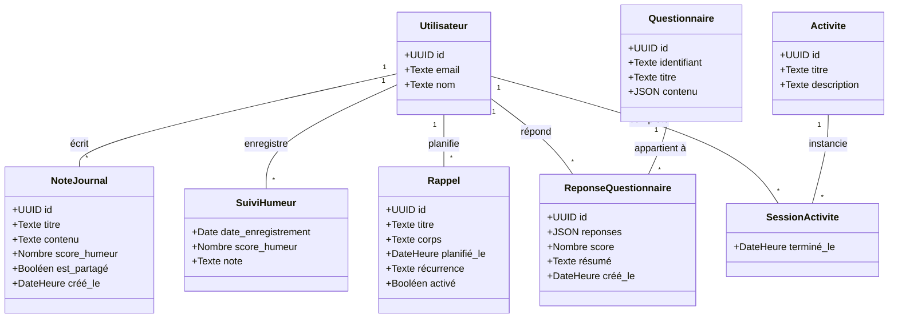
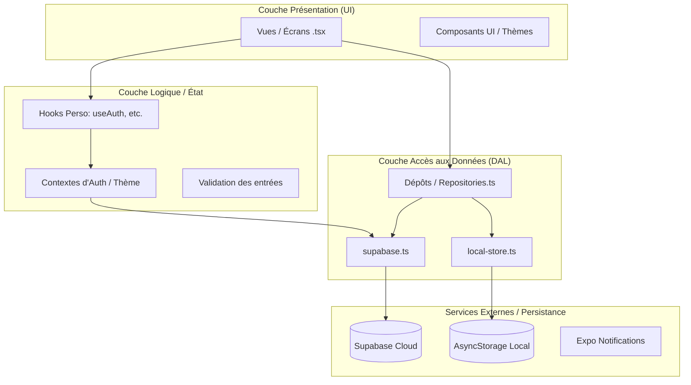
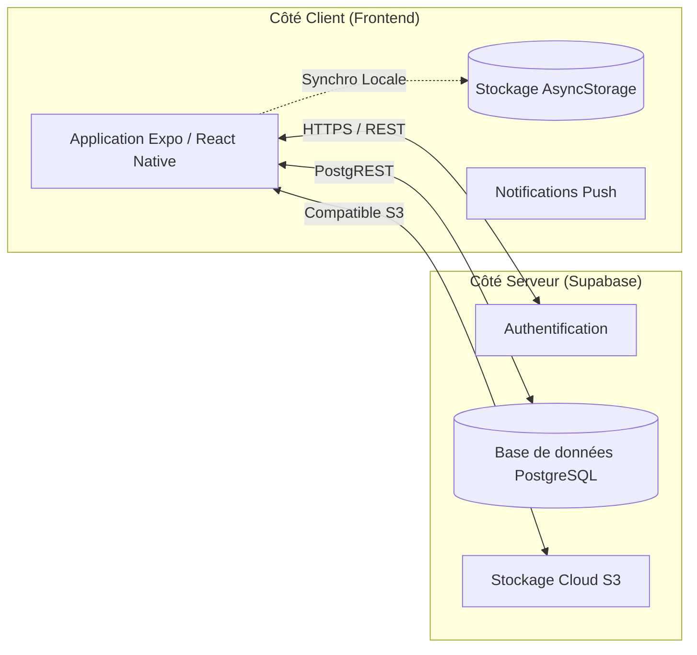
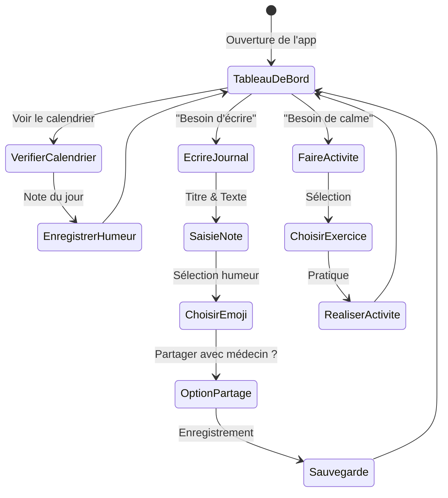

# Diagrammes de l'Application Ochitsu

Ce document présente les différents diagrammes modélisant l'application Ochitsu, entièrement en français.

## 1. Diagramme Conceptuel (Modèle de Données)
Ce diagramme illustre les entités métier et leurs relations.

## 2. Diagramme Logique (Architecture Applicative)
Ce diagramme détaille l'organisation fonctionnelle en couches de l'application.

## 3. Diagramme Physique (Architecture Technique)
Ce diagramme illustre les composants technologiques et l'infrastructure.

## 4. Diagramme d'Activité (Parcours Utilisateur Type)
Exemple d'une session quotidienne typique.

